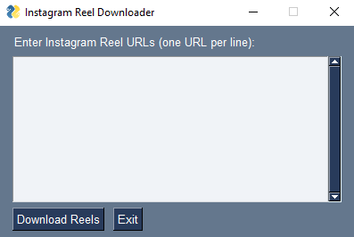

# Instagram Reel Downloader

Instagram Reel Downloader is a simple tool that allows you to download Instagram reels using the Instaloader Python library. With this tool, you can download multiple reels at once by entering their URLs in a text box.
  


## Installation

1. Clone this repository to your local machine.
```
git clone https://github.com/oxygenta/instagram-reel-downloader.git
```
2. Install the required dependencies using pip.
```
pip install instaloader tkinter
```

## Usage

1. Open a terminal window and navigate to the cloned repository directory.
```
cd instagram-reel-downloader
```
2. Run the `app.py` file to start the GUI application.
```
python app.py
```
3. In the application window, enter the Instagram reel URLs that you want to download, one URL per line.
4. Click the "Download Reels" button to start the download process.
5. Wait for the download to finish. Once the download is complete, a success message will be displayed.

## Contributing

If you find any bugs or issues with this tool, please feel free to open an issue in the GitHub repository. Pull requests are also welcome if you want to contribute to the code.

## License

This tool is licensed under the MIT License. See the LICENSE file for more details.
EOF
